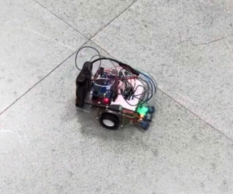
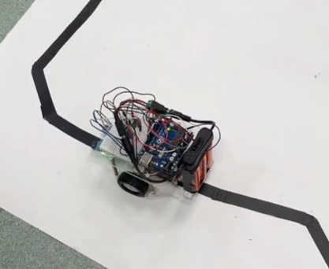

# Differential-Drive Mobile-robot
Differential-drive robot with DC motor control and embedded navigation.

## Overview

Designed and implemented a differential-drive mobile robot controlled by two DC motors using an AVR ATmega328P microcontroller. The project focused on embedded motor control, robot steering, and autonomous navigation algorithms.

The robot supports two navigation modes:

- **Basic Navigation Mode**  
  The robot autonomously navigates around a predefined rectangular path using timed motion control and turning sequences.

- **Advanced Line-Following Mode**  
  The robot utilizes infrared sensors to detect and follow a predefined track, demonstrating real-time sensor feedback and motion correction.

The robot was programmed to navigate around a predefined rectangular field while maintaining stable movement and directional control. Through this project, I learned embedded system programming, DC motor control, and fundamental mobile robot navigation concepts.

## Demo

Click the image above to watch the demo video!

### Basic Navigation Mode

  

### Advanced Line-Following Mode

  

## Key Features
- DC motor control
- Differential-drive robot design
- Forward / left / right motion control
- Basic navigation logic
- Embedded system integration
## Hardware Used
- AVR ATmega328P Microcontroller
- H-Bridge Motor Driver Board
- Two-Wheel Robot Chassis
- DC Motors

## Hardware Setup

## Source Code

Use Timer0 and Timer2 to generate the PWM signals. Connect OC0A and OC0B (PD6 and
PD5) to IN1 and IN2. These two output signals control a DC motor. 
Connect OC2A and OC2B (PB3 and PD3) to IN3 and IN4.These two output signals
control the other DC motor.

The complete embedded control program is available in the `src/` directory.

## Technologies Used
- C++ / Arduino
- Embedded Programming
- Robot Navigation Logic
